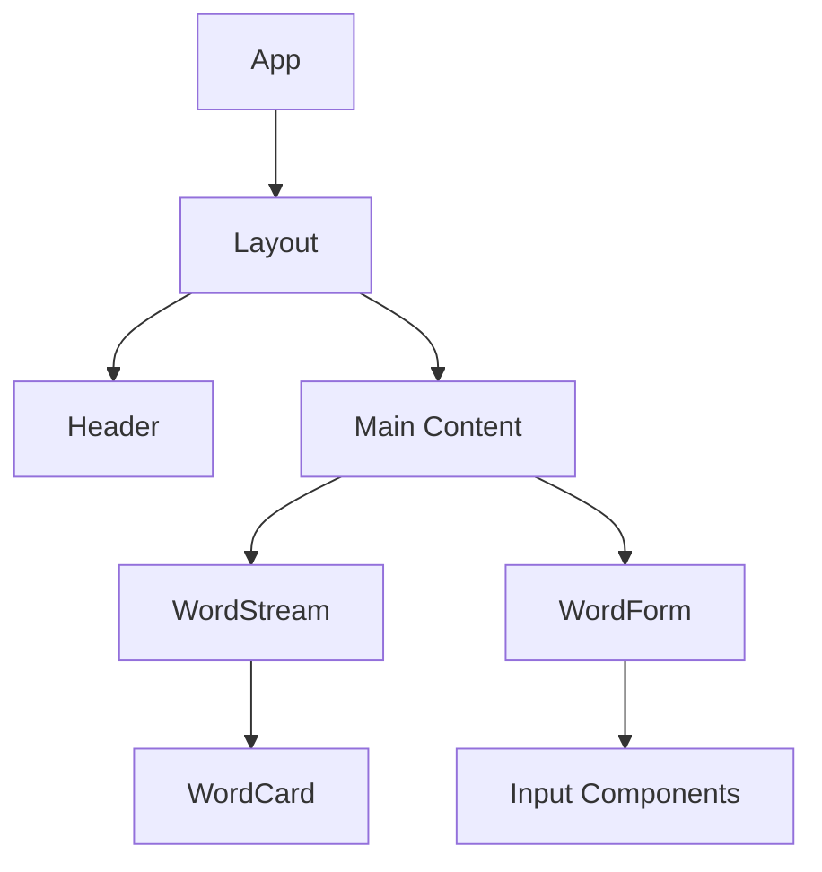

# System Patterns

## Architecture Overview
- Frontend: React + TypeScript + Vite
- UI Components: shadcn/ui
- Styling: Tailwind CSS
- State Management: React Query
- Routing: React Router DOM

## Key Technical Choices
1. **Frontend Framework**
   - React 18
   - TypeScript 5.5
   - Vite 5.4

2. **UI Components**
   - shadcn/ui components
   - Radix UI primitives
   - Tailwind CSS for styling

3. **State Management**
   - React Query for server state
   - React Hooks for local state

4. **Routing**
   - React Router DOM v6
   - Client-side routing

## Design Patterns
1. **Component Pattern**
   - Atomic Design
   - Composition over Inheritance
   - Custom Hooks

2. **State Management Pattern**
   - Server State with React Query
   - Local State with useState/useReducer
   - Context for global state

3. **Styling Pattern**
   - Utility-first CSS with Tailwind
   - CSS Modules for component-specific styles
   - Global styles with CSS variables

## Component Relationships
